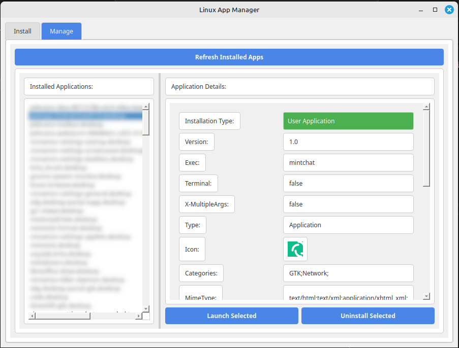

# Linux program installer
--- 
A PyQt5-based GUI application for installing and managing `.appimage` and other Linux executables.  

### **Features**  
- Install `.appimage` and executable files with proper system integration  
- Rename applications before installation  
- Extract default icons from `.appimage` or executable files  
- Set installation categories (e.g., Utilities, Development, Multimedia)  
- Add search keywords for quick access  
- Manage dependencies and additional configurations  
- Colorful, interactive, and user-friendly design  
- Automatically clear input fields after installation  

### **Screenshots**  
### Main Interface


### Manage application Panel


### **Installation**  
1. Install dependencies:  
   ```sh
   pip install pyqt5 pyqt5-tools
   ```
2. Run the application:  
   ```sh
   python main.py
   ```

### **Usage**  
1. Open the application  
2. Select an `.appimage` or executable file  
3. Customize settings (rename, icon, category, etc.)  
4. Click "Install" to integrate it into the system  

### **License**  
MIT License  

---

